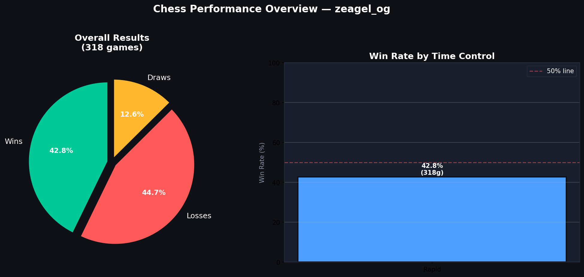
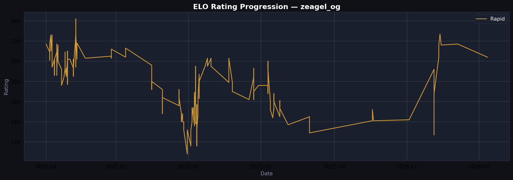

# ♛ Chess.com Personal Game Analytics

> Analyzing 500+ real Chess.com games using Python, SQL, Power BI, and Tableau to uncover patterns in openings, ELO progression, and win rates.

## 📊 Live Dashboards
- 🔵 Power BI: *[link coming soon]*
- 🟠 Tableau Public: *[link coming soon]*
- 🟢 Looker Studio: *[link coming soon]*

## 🗂️ Project Structure
| File | Description |
|------|-------------|
| `chess_analytics-notebook.ipynb` | Full Python analysis notebook |
| `chess_games_clean.csv` | Cleaned game dataset |
| `chess_openings_summary.csv` | Opening win rate analysis |
| `chess_monthly_summary.csv` | Monthly performance trends |

## 📈 Key Insights
- Best performing opening by win rate
- ELO progression over time
- Win rate by day of week & time of day
- Opponent strength analysis

## 🛠️ Tech Stack
- **Python** — Pandas, NumPy, Matplotlib, Seaborn
- **SQL** — Analytical queries on game data
- **Power BI** — Interactive 3-page dashboard
- **Tableau Public** — Published live dashboard
- **Looker Studio** — Real-time Google dashboard

## 📁 Charts Preview

